# HoneyAI UI/UX Specification

**Version:** 2.0
**Date:** 2026-01-19
**Author:** Sally - UX Expert
**Status:** Complete

---

## Introduction

This document defines the user experience goals, information architecture, user flows, and visual design specifications for HoneyAI's user interface. It serves as the foundation for visual design and frontend development, ensuring a cohesive and user-centered experience.

### Change Log

| Date | Version | Description | Author |
|------|---------|-------------|--------|
| 2026-01-19 | 2.0 | Complete UI/UX Specification | Sally (UX Expert) |

---

## Overall UX Goals & Principles

### Target User Personas

**Primary Persona: Marie & Jean (Les Parents Apiculteurs)**
- **Age:** 50-65 years
- **Technical skills:** Basic (email, web browsing) - no advanced computer knowledge
- **Context:** Family beekeeping operation (~40 hives), currently using paper notebook
- **Pain points:** Fear of "breaking things", frustration with complex interfaces, no time to learn during busy season (Sept-Dec)
- **Goals:** Simplify administrative tasks, stop wasting time on labels, gain visibility on business
- **Usage pattern:** Desktop only (Windows 10+), single workstation, daily use during peak season

**Secondary Persona: Fils Développeur (Tech Support)**
- Developer providing family support
- Needs: maintainable code, remote debugging capability, clear documentation

### Usability Goals

1. **Zero Learning Curve:** New users complete core tasks (create client, create order) within 5 minutes of first use, without any training
2. **Efficiency of Recovery:** Users can return after 4 months off-season and immediately remember how to use the application
3. **Error Prevention:** Confirmation dialogs for all destructive actions, soft delete everywhere, impossible to lose data accidentally
4. **Confidence Building:** Clear feedback after every action ("Bien enregistré ✓"), reassuring messages, no intimidating technical jargon
5. **Speed of Task Completion:** Frequent tasks (new order, generate labels) achievable in ≤2 clicks from any screen

### Design Principles

1. **Cahier numérique augmenté** - Interface mirrors the mental model of their paper notebook, not a complex database
2. **Simplicité radicale** - No hidden menus, no nested navigation, every feature visible at first glance
3. **Confiance et contrôle** - Users always know what happened, what will happen, and can undo mistakes
4. **Lisibilité optimale** - 16px minimum font, high contrast, generous spacing - designed for 50-65 year old eyes
5. **Gains immédiats visibles** - The "killer feature" (label generation) is prominently accessible, demonstrating instant value

---

## Information Architecture (IA)

### Site Map / Screen Inventory

```mermaid
graph TD
    A[🏠 Tableau de bord<br/>Dashboard Home] --> B[👥 Clients]
    A --> C[📦 Commandes]
    A --> D[🏷️ Étiquettes]
    A --> E[📊 Produits & Tarifs]
    A --> F[🛒 Achats]
    A --> G[💾 Sauvegarde]

    B --> B1[Liste Clients]
    B1 --> B2[Fiche Client Détail]
    B1 --> B3[Formulaire Client<br/>Nouveau/Modifier]
    B2 --> B3
    B2 -.-> C2

    C --> C1[Liste Commandes]
    C1 --> C2[Fiche Commande Détail]
    C1 --> C3[Formulaire Commande<br/>Nouvelle/Modifier]
    C2 --> C3

    D --> D1[Formulaire Génération]
    D --> D2[Historique Étiquettes]
    D1 -.->|PDF Download| D3[📄 PDF Étiquettes]

    E --> E1[Catalogue Produits]
    E1 --> E2[Modifier Tarif]

    F --> F1[Liste Achats]
    F1 --> F2[Formulaire Achat<br/>Ajout rapide intégré]

    G --> G1[Gestion Sauvegardes]
```



### Navigation Structure

**Primary Navigation (Sidebar - Always Visible):**

| Icon | Label | Route | Description |
|------|-------|-------|-------------|
| 🏠 | Tableau de bord | `/` | Financial overview, quick actions |
| 👥 | Clients | `/clients` | Client list and management |
| 📦 | Commandes | `/orders` | Order list and management |
| 🏷️ | Étiquettes | `/etiquettes` | Label generation (killer feature) |
| 📊 | Produits | `/produits` | Product catalog & pricing |
| 🛒 | Achats | `/achats` | Supply purchases tracking |
| 💾 | Sauvegarde | `/backup` | Backup management |

**Design decisions:**
- Sidebar persistent on all pages (never collapses on desktop)
- Large icons (24px+) with text labels always visible
- Active page clearly highlighted (amber background)
- Maximum 7 items - all features at same level, no sub-menus

**Secondary Navigation:**
- None required - flat hierarchy by design
- All screens reachable in 1 click from sidebar

**Breadcrumb Strategy:**
- Simple text showing current location: "Clients > Jean Dupont" or "Commandes > Commande #42"
- Back button always visible on detail/form pages
- No deep nesting (max 2 levels)

---

## User Flows

### Flow 1: Client Creation & Order Workflow

**User Goal:** Register a new customer and create their first order

**Entry Points:**
- Dashboard "Nouveau Client" quick action
- Clients list "Nouveau Client" button
- Direct navigation to `/clients/nouveau`

**Success Criteria:** Client saved, order created with products, confirmation displayed

```mermaid
graph TD
    A[📍 Start: Dashboard or<br/>Clients List] --> B{Client exists?}
    B -->|No| C[Click 'Nouveau Client']
    B -->|Yes| D[Search & Select Client]

    C --> E[Fill Client Form<br/>Nom*, Téléphone, Email,<br/>Adresse, Notes]
    E --> F{Form Valid?}
    F -->|No| G[Show inline errors<br/>Red text below field]
    G --> E
    F -->|Yes| H[Click 'Enregistrer']
    H --> I[✅ Toast: 'Client enregistré'<br/>Redirect to Client Detail]

    I --> J[Click 'Nouvelle order<br/>pour ce client']
    D --> J

    J --> K[Order Form<br/>Client pre-selected]
    K --> L[Add Product Lines<br/>Select product + quantity]
    L --> M{More products?}
    M -->|Yes| N[Click '+ Ajouter produit']
    N --> L
    M -->|No| O[Review total<br/>Add notes if needed]
    O --> P[Click 'Enregistrer']
    P --> Q[✅ Toast: 'Commande créée'<br/>Redirect to Order Detail]
    Q --> R[📍 End: Order Detail<br/>Status = COMMANDÉE]
```



**Edge Cases & Error Handling:**
- Duplicate client name: Allow (common names exist), search helps find existing
- Empty product lines: Validation error "Ajoutez au moins un produit"
- Network/save failure: Error toast + form data preserved, retry possible
- Browser back during form: Confirmation "Quitter sans enregistrer?"

### Flow 2: Order Status Lifecycle

**User Goal:** Track order from creation through pickup to payment

**Entry Points:**
- Order list filtered by status
- Client detail → order history
- Dashboard → recent orders

**Success Criteria:** Order progresses through all 3 states with clear visual feedback

```mermaid
graph TD
    A[📍 Order Created<br/>Status: COMMANDÉE 🔵] --> B[Customer arrives<br/>to pick up order]

    B --> C[Open Order Detail]
    C --> D[Click 'Marquer comme<br/>Récupérée' 🟠]
    D --> E{Confirm action?}
    E -->|Cancel| C
    E -->|Confirm| F[✅ Status updated<br/>Stock decremented<br/>Toast confirmation]

    F --> G[📍 Status: RÉCUPÉRÉE 🟠]

    G --> H[Customer pays]
    H --> I[Click 'Marquer comme<br/>Payée' 🟢]
    I --> J{Confirm action?}
    J -->|Cancel| G
    J -->|Confirm| K[✅ Status updated<br/>Added to CA calculations<br/>Toast confirmation]

    K --> L[📍 Status: PAYÉE 🟢<br/>Order complete ✓]
```



**Edge Cases & Error Handling:**
- Invalid transition (e.g., PAYÉE → COMMANDÉE): Button not shown, backend rejects if forced
- Accidental status change: No undo in MVP, but soft transitions (can re-open order via support)
- Partial payment: Not supported MVP - order is fully paid or not (use Notes field for exceptions)

### Flow 3: Label Generation (Killer Feature)

**User Goal:** Generate printable PDF labels for honey jars

**Entry Points:**
- Sidebar "Étiquettes" (prominent position)
- Dashboard quick action

**Success Criteria:** PDF downloads with correct regulatory information, ready to print

```mermaid
graph TD
    A[📍 Start: Click 'Étiquettes'<br/>in sidebar] --> B[Label Generation Form]

    B --> C[Select Type de miel<br/>Dropdown: Toutes Fleurs,<br/>Forêt, Châtaignier]
    C --> D[Select Format pot<br/>Radio: 500g / 1kg]
    D --> E[Enter Date de récolte<br/>Datepicker, default today]
    E --> F[Enter Quantité<br/>Number input, default 10]

    F --> G{Form complete?}
    G -->|No| H[Highlight missing fields]
    H --> C

    G -->|Yes| I[Click 'Générer PDF' 🟢]
    I --> J[Loading spinner<br/>'Génération en cours...']
    J --> K{Generation OK?}

    K -->|Error| L[❌ Error toast<br/>'Erreur, réessayez']
    L --> B

    K -->|Success| M[📄 PDF Downloads<br/>Browser download dialog]
    M --> N[✅ Toast: 'PDF généré<br/>21 étiquettes créées']
    N --> O[Form reset for<br/>next batch]

    O --> P{Generate more?}
    P -->|Yes| C
    P -->|No| Q[📍 End: User prints PDF<br/>via system print dialog]
```



**Edge Cases & Error Handling:**
- No price configured for product/year: Use last known price, show warning
- Very large quantity (500+): Allow but show generation time estimate
- PDF generation timeout: Retry with smaller batch suggestion
- Printer not connected: Not app's concern - standard PDF workflow

### Flow 4: Dashboard Financial Overview

**User Goal:** Quickly understand business performance (CA, expenses, profit)

**Entry Points:**
- App launch (default landing page)
- Sidebar "Tableau de bord"

**Success Criteria:** Key metrics visible at a glance, filterable by period

```mermaid
graph TD
    A[📍 Start: Open App or<br/>Click Dashboard] --> B[Dashboard loads<br/>Default: Current Year]

    B --> C[View Metric Cards<br/>CA, Dépenses, Bénéfice,<br/>Commandes Payées]

    C --> D{Need different period?}
    D -->|No| E[View Top 3 Produits]
    D -->|Yes| F[Select Year/Month<br/>from filter dropdown]
    F --> G[Metrics recalculate<br/>Cards update]
    G --> E

    E --> H[View Expense Breakdown<br/>by Category]

    H --> I{Take action?}
    I -->|View orders| J[Click card → /orders<br/>filtered by status]
    I -->|View expenses| K[Click breakdown →<br/>/achats filtered]
    I -->|No action| L[📍 End: Informed user]

    J --> L
    K --> L
```



**Edge Cases & Error Handling:**
- No data for period: Show "Aucune donnée" with friendly message, not empty cards
- Calculation errors: Display "—" rather than wrong numbers
- Slow calculation: Show skeleton loaders, not blank screen

---

## Wireframes & Mockups

**Primary Design Files:** To be created in Figma/design tool based on these specifications

### Screen 1: Tableau de Bord (Dashboard)

**Purpose:** Provide at-a-glance financial overview and quick access to common actions

**Layout Structure:**
```
┌─────────────────────────────────────────────────────────────────┐
│  🍯 HoneyAI                           [Année: 2026 ▼]           │
├────────────┬────────────────────────────────────────────────────┤
│            │                                                     │
│  SIDEBAR   │   ┌─────────┐ ┌─────────┐ ┌─────────┐ ┌─────────┐ │
│            │   │   CA    │ │Dépenses │ │Bénéfice │ │Commandes│ │
│  🏠 Tableau│   │ 12 450€ │ │ 2 340€  │ │ 10 110€ │ │Payées:42│ │
│     de bord│   │   +15%  │ │   -5%   │ │   +18%  │ │         │ │
│  👥 Clients│   └─────────┘ └─────────┘ └─────────┘ └─────────┘ │
│  📦 Command│                                                     │
│  🏷️ Étiquet│   ┌─────────────────────┐ ┌─────────────────────┐ │
│  📊 Produit│   │  TOP 3 PRODUITS     │ │ DÉPENSES PAR        │ │
│  🛒 Achats │   │  ─────────────────  │ │ CATÉGORIE           │ │
│  💾 Sauvega│   │  1. Miel 500g TF    │ │ ████████ Pots 45%   │ │
│            │   │  2. Miel 1kg Forêt  │ │ █████ Cire 28%      │ │
│            │   │  3. Miel 500g Châta │ │ ███ Couvercles 15%  │ │
│            │   └─────────────────────┘ └─────────────────────┘ │
│            │                                                     │
│            │   ┌─────────────────────────────────────────────┐ │
│            │   │  ACTIONS RAPIDES                            │ │
│            │   │  [+ Nouveau Client] [+ Nouvelle Commande]   │ │
│            │   │  [🏷️ Générer Étiquettes]                    │ │
│            │   └─────────────────────────────────────────────┘ │
│            │                                                     │
└────────────┴────────────────────────────────────────────────────┘
```

**Key Elements:**
- 4 metric cards (CA, Dépenses, Bénéfice, Commandes) - large numbers, icons, optional trend indicator
- Top 3 products widget - ranked list with quantities
- Expense breakdown - simple horizontal bars by category
- Quick actions section - large buttons for frequent tasks

**Interaction Notes:**
- Metric cards clickable → navigate to filtered list
- Year filter dropdown refreshes all metrics
- Quick action buttons are prominent (green, full-width on mobile)

### Screen 2: Liste Clients

**Purpose:** Find and manage customer records

**Layout Structure:**
```
┌─────────────────────────────────────────────────────────────────┐
│  🍯 HoneyAI              Clients > Liste                        │
├────────────┬────────────────────────────────────────────────────┤
│            │                                                     │
│  SIDEBAR   │   👥 Mes Clients                    [+ Nouveau] 🟢 │
│            │   ───────────────────────────────────────────────── │
│  (active:  │                                                     │
│   Clients) │   🔍 [Rechercher par nom ou téléphone...        ]  │
│            │                                                     │
│            │   ┌─────────────────────────────────────────────┐ │
│            │   │ NOM          │ TÉLÉPHONE  │ COMMANDES │     │ │
│            │   ├──────────────┼────────────┼───────────┼─────┤ │
│            │   │ Dupont Jean  │ 06 12 34.. │ 8         │[Voir]│ │
│            │   │ Martin Marie │ 06 98 76.. │ 12        │[Voir]│ │
│            │   │ Bernard Paul │ 07 11 22.. │ 3         │[Voir]│ │
│            │   └─────────────────────────────────────────────┘ │
│            │                                                     │
│            │   Affichage 1-25 sur 156 clients                   │
│            │   [Voir plus ▼]                                    │
│            │                                                     │
└────────────┴────────────────────────────────────────────────────┘
```

**Key Elements:**
- Page title with icon and "Nouveau" button (top-right, green, prominent)
- Large search bar with placeholder text and search icon
- Table with alternating row colors (zebra striping)
- Columns: Nom, Téléphone, Nombre de orders, Actions

### Screen 3: Fiche Client (Détail)

**Purpose:** View complete client information and order history

**Layout Structure:**
```
┌─────────────────────────────────────────────────────────────────┐
│  🍯 HoneyAI              Clients > Jean Dupont                  │
├────────────┬────────────────────────────────────────────────────┤
│            │                                                     │
│  SIDEBAR   │   [← Retour à la liste]                            │
│            │                                                     │
│            │   👤 Jean Dupont                                   │
│            │   ───────────────────────────────────────────────── │
│            │                                                     │
│            │   📞 Téléphone: 06 12 34 56 78                     │
│            │   ✉️  Email: jean.dupont@email.fr                   │
│            │   📍 Adresse: 12 rue des Abeilles, 12000 Rodez     │
│            │   📝 Notes: Client fidèle depuis 2018              │
│            │                                                     │
│            │   [Modifier] 🔵  [Supprimer] 🔴                    │
│            │                                                     │
│            │   ─────────────────────────────────────────────────│
│            │   📦 HISTORIQUE COMMANDES                          │
│            │   Total: 8 orders | 456,00 € dépensés           │
│            │                                                     │
│            │   [+ Nouvelle order pour ce client] 🟢          │
│            │                                                     │
│            │   │ DATE       │ STATUT      │ MONTANT │          │ │
│            │   │ 15/10/2025 │ 🟢 Payée    │ 67,00 € │ [Voir]   │ │
│            │   │ 22/09/2025 │ 🟠 Récupérée│ 45,00 € │ [Voir]   │ │
│            │   │ 10/11/2024 │ 🟢 Payée    │ 89,00 € │ [Voir]   │ │
│            │                                                     │
└────────────┴────────────────────────────────────────────────────┘
```

### Screen 4: Formulaire Commande (Création)

**Purpose:** Create new order with dynamic product lines

**Layout Structure:**
```
┌─────────────────────────────────────────────────────────────────┐
│  🍯 HoneyAI              Commandes > Nouvelle                   │
├────────────┬────────────────────────────────────────────────────┤
│            │                                                     │
│  SIDEBAR   │   [← Annuler]                                      │
│            │                                                     │
│            │   📦 Nouvelle Commande                             │
│            │   ───────────────────────────────────────────────── │
│            │                                                     │
│            │   CLIENT *                                          │
│            │   [🔍 Rechercher un client...              ▼]      │
│            │                                                     │
│            │   DATE COMMANDE *                                   │
│            │   [📅 19/01/2026                            ]      │
│            │                                                     │
│            │   ─────────────────────────────────────────────────│
│            │   PRODUITS COMMANDÉS                               │
│            │                                                     │
│            │   │ PRODUIT              │ QTÉ │ PRIX U. │ TOTAL  ││
│            │   │ [Miel 500g TF    ▼]  │ [3] │ 8,50 €  │ 25,50 €││
│            │   │ [Miel 1kg Forêt ▼]   │ [2] │ 15,00 € │ 30,00 €││
│            │                                                     │
│            │   [+ Ajouter un produit]                           │
│            │                                                     │
│            │                          TOTAL COMMANDE: 55,50 €   │
│            │   ─────────────────────────────────────────────────│
│            │   NOTES (optionnel)                                │
│            │   [Livraison prévue samedi matin                ]  │
│            │                                                     │
│            │          [Annuler]      [Enregistrer] 🟢           │
│            │                                                     │
└────────────┴────────────────────────────────────────────────────┘
```

### Screen 5: Génération Étiquettes

**Purpose:** Generate regulatory PDF labels for honey jars

**Layout Structure:**
```
┌─────────────────────────────────────────────────────────────────┐
│  🍯 HoneyAI              Étiquettes > Générer                   │
├────────────┬────────────────────────────────────────────────────┤
│            │                                                     │
│  SIDEBAR   │   🏷️ Générer des Étiquettes                        │
│            │   ───────────────────────────────────────────────── │
│            │                                                     │
│            │   TYPE DE MIEL *                                   │
│            │   ○ Toutes Fleurs  ○ Forêt  ○ Châtaignier         │
│            │                                                     │
│            │   FORMAT DU POT *                                   │
│            │   ┌─────────────┐  ┌─────────────┐                 │
│            │   │ ○  500g    │  │ ●  1kg     │                  │
│            │   └─────────────┘  └─────────────┘                 │
│            │                                                     │
│            │   DATE DE RÉCOLTE *                                 │
│            │   [📅 15/06/2025                            ]      │
│            │                                                     │
│            │   QUANTITÉ D'ÉTIQUETTES *                          │
│            │   [    21    ]  (21 étiquettes par feuille A4)     │
│            │                                                     │
│            │   ─────────────────────────────────────────────────│
│            │   APERÇU                                           │
│            │   ┌─────────────────────────────┐                  │
│            │   │  Miel de Forêt              │                  │
│            │   │  Poids net: 1kg             │                  │
│            │   │  Exploitation Familiale     │                  │
│            │   │  SIRET: XXX XXX XXX         │                  │
│            │   │  DLUO: 06/2027              │                  │
│            │   │  Lot: 2025-FOR-001          │                  │
│            │   │  Prix: 15,00 €              │                  │
│            │   └─────────────────────────────┘                  │
│            │                                                     │
│            │         [📄 Générer PDF] 🟢                        │
│            │                                                     │
│            │   [Voir l'historique des étiquettes →]             │
│            │                                                     │
└────────────┴────────────────────────────────────────────────────┘
```

### Additional Screens Summary

| Screen | Key Features |
|--------|--------------|
| **Formulaire Client** | Simple vertical form, required field markers (*), inline validation |
| **Liste Commandes** | Year + Status filters, table with status badges (colored) |
| **Fiche Commande** | Order details, product lines table, status transition buttons |
| **Catalogue Produits** | Product table with prices by year, inline edit for tariffs |
| **Liste Achats** | Quick-add form at top, chronological list, category badges |
| **Gestion Sauvegarde** | Info panel, recent backups list, download links |

---

## Component Library / Design System

### Design System Approach

**Framework:** Bootstrap 5.3 (CDN) with minimal custom CSS overrides

**Files Structure:**
```
static/
├── css/
│   └── honeyai-custom.css    # Brand overrides only (~100 lines)
├── js/
│   └── honeyai.js            # Dynamic forms, confirmations (~200 lines)
└── icons/                     # Favicon, app icon
```

### Core Components

#### Primary Button

**Bootstrap Base:** `.btn .btn-success`

| Variant | Class | Usage |
|---------|-------|-------|
| Primary Action | `.btn-success` (green) | Enregistrer, Générer PDF |
| Secondary Action | `.btn-secondary` (grey) | Annuler, Retour |
| Danger Action | `.btn-danger` (red) | Supprimer |
| Info/Link | `.btn-outline-primary` | Voir, Modifier |

**Custom Overrides:**
```css
.btn {
  min-height: 44px;
  min-width: 44px;
  font-size: 1rem;
  padding: 0.625rem 1.25rem;
  border-radius: 0.5rem;
}
```

#### Form Input

**Bootstrap Base:** `.form-control`

**Custom Overrides:**
```css
.form-control {
  font-size: 1rem;
  padding: 0.75rem 1rem;
  min-height: 44px;
  border-radius: 0.375rem;
}

.form-control:focus {
  border-color: #F4B942;
  box-shadow: 0 0 0 0.2rem rgba(244, 185, 66, 0.25);
}
```

#### Status Badge

**Bootstrap Base:** `.badge`

| Status | Class | Color |
|--------|-------|-------|
| COMMANDÉE | `.bg-primary` | Blue |
| RÉCUPÉRÉE | `.bg-warning text-dark` | Orange |
| PAYÉE | `.bg-success` | Green |

#### Data Table

**Bootstrap Base:** `.table .table-striped .table-hover`

```css
.table-hover tbody tr:hover {
  background-color: rgba(244, 185, 66, 0.1);
  cursor: pointer;
}
```

#### Alert / Toast Notification

**Bootstrap Base:** `.alert` for inline, custom toast for notifications

| Type | Class | Icon |
|------|-------|------|
| Success | `.alert-success` | ✓ |
| Error | `.alert-danger` | ✕ |
| Warning | `.alert-warning` | ⚠ |
| Info | `.alert-info` | ℹ |

#### Confirmation Modal

**Bootstrap Base:** `.modal`

- Always for delete operations
- "Annuler" button first, "Supprimer" second (red)
- Escapable via Esc key or backdrop click

#### Metric Card

**Bootstrap Base:** `.card`

```css
.card-metric .metric-value {
  font-size: 2rem;
  font-weight: 700;
  color: #2D5016;
}
```

#### Sidebar Navigation

```css
.sidebar {
  width: 220px;
  background-color: #2D5016;
  color: white;
  position: fixed;
  height: 100vh;
}

.sidebar .nav-link.active {
  background-color: #F4B942;
  color: #2D5016;
  font-weight: 600;
}
```

---

## Branding & Style Guide

### Color Palette

| Color Type | Hex Code | Usage |
|------------|----------|-------|
| **Primary (Amber/Honey)** | `#F4B942` | Primary buttons, active states, highlights |
| **Secondary (Forest Green)** | `#2D5016` | Sidebar background, headings |
| **Background** | `#FAFAF8` | Page background (warm white) |
| **Surface** | `#FFFFFF` | Cards, modals, forms |
| **Text Primary** | `#212529` | Body text, headings |
| **Text Secondary** | `#6C757D` | Labels, helper text |
| **Success** | `#198754` | Positive feedback, PAYÉE status |
| **Warning** | `#FFC107` | Cautions, RÉCUPÉRÉE status |
| **Error** | `#DC3545` | Errors, destructive actions |
| **Info** | `#0D6EFD` | COMMANDÉE status |
| **Border** | `#DEE2E6` | Table borders, input borders |

**CSS Variables:**
```css
:root {
  --honey-amber: #F4B942;
  --forest-green: #2D5016;
  --bg-page: #FAFAF8;
  --bg-surface: #FFFFFF;
  --text-primary: #212529;
  --text-secondary: #6C757D;
  --color-success: #198754;
  --color-warning: #FFC107;
  --color-error: #DC3545;
  --color-info: #0D6EFD;
  --border-color: #DEE2E6;
}
```

### Typography

**Font Family:** Inter (Google Fonts) with system fallback

```css
font-family: 'Inter', -apple-system, BlinkMacSystemFont, "Segoe UI", Roboto, sans-serif;
```

**Type Scale:**

| Element | Size | Weight | Line Height |
|---------|------|--------|-------------|
| H1 | 32px (2rem) | 700 | 1.2 |
| H2 | 24px (1.5rem) | 600 | 1.3 |
| H3 | 20px (1.25rem) | 600 | 1.4 |
| Body | 16px (1rem) | 400 | 1.5 |
| Small | 14px (0.875rem) | 400 | 1.4 |
| Metric | 36px (2.25rem) | 700 | 1.1 |

### Iconography

**Icon Library:** Font Awesome 6.4 (Free tier, CDN)

| Context | Icon | Class |
|---------|------|-------|
| Dashboard | 🏠 | `fa-house` |
| Clients | 👥 | `fa-users` |
| Orders | 📦 | `fa-box` |
| Labels | 🏷️ | `fa-tag` |
| Products | 📊 | `fa-chart-bar` |
| Purchases | 🛒 | `fa-cart-shopping` |
| Backup | 💾 | `fa-floppy-disk` |
| Add | ➕ | `fa-plus` |
| Edit | ✏️ | `fa-pen` |
| Delete | 🗑️ | `fa-trash` |
| Search | 🔍 | `fa-magnifying-glass` |
| Success | ✅ | `fa-check-circle` |
| Error | ❌ | `fa-times-circle` |

### Spacing Scale

| Token | Size | Usage |
|-------|------|-------|
| `--space-1` | 4px | Icon-text gap |
| `--space-2` | 8px | Related elements |
| `--space-3` | 12px | Form field margins |
| `--space-4` | 16px | Section padding |
| `--space-5` | 24px | Card padding |
| `--space-6` | 32px | Section gaps |

### Layout Grid

```css
.sidebar { width: 220px; }
.main-content { margin-left: 220px; }
.content-container { max-width: 1200px; margin: 0 auto; padding: 24px; }
```

---

## Accessibility Requirements

### Compliance Target

**Standard:** WCAG 2.1 Level AA

### Visual Accessibility

**Color Contrast:**
- Text: Minimum 4.5:1 contrast ratio
- Large text: Minimum 3:1 contrast ratio
- UI Components: Minimum 3:1

**Focus Indicators:**
```css
*:focus-visible {
  outline: 3px solid #F4B942;
  outline-offset: 2px;
}
```

**Text Sizing:**
- Minimum font size: 16px for body text
- No text smaller than 14px
- All sizes in rem (respects user zoom)

**Color Independence:**
- Status badges include text labels, not just color
- Form errors include icon + text

### Keyboard Navigation

| Action | Keys |
|--------|------|
| Navigate elements | Tab / Shift+Tab |
| Activate button | Enter or Space |
| Close modal | Escape |
| Navigate dropdown | Arrow keys |

**Skip Link:**
```html
<a href="#main-content" class="skip-link">Aller au contenu principal</a>
```

**Touch Targets:**
- Minimum size: 44×44 pixels
- Minimum spacing: 8px between targets

### Screen Reader Support

- Semantic HTML5 elements (`<nav>`, `<main>`, `<header>`)
- ARIA landmarks for regions
- ARIA live regions for dynamic content
- Proper heading hierarchy (h1 → h2 → h3)

**Form Labels:**
```html
<label for="client-nom" class="form-label">
  Nom <span class="text-danger" aria-hidden="true">*</span>
</label>
<input type="text" id="client-nom" required aria-required="true" aria-describedby="nom-error">
```

### Testing Strategy

| Tool | Purpose |
|------|---------|
| axe DevTools | Quick accessibility checks |
| WAVE | Visual accessibility report |
| Lighthouse | Accessibility audit score |
| NVDA | Screen reader testing |

---

## Responsiveness Strategy

### Breakpoints

| Breakpoint | Min Width | Target Devices | Priority |
|------------|-----------|----------------|----------|
| Desktop (Primary) | 1280px | Windows laptops, desktops | Critical |
| Desktop Small | 992px | Smaller monitors | Important |
| Tablet | 768px | iPad, tablets | Future |
| Mobile | 320px | Phones | Out of Scope |

### Layout Changes

**Desktop (1280px+):**
- Fixed sidebar (220px)
- Main content (flex: 1)
- Max-width: 1200px, centered

**Desktop Small (992px - 1279px):**
- Sidebar (200px)
- Main content (100%)
- Tables may scroll horizontally

**Tablet (768px - 991px) - Future:**
- Collapsible sidebar (hamburger menu)
- Cards stack vertically
- Tables horizontally scrollable

### Responsive CSS

```css
.app-layout { display: flex; min-height: 100vh; }
.sidebar { width: 220px; position: fixed; height: 100vh; }
.main-content { flex: 1; margin-left: 220px; }

@media (max-width: 1279px) {
  .sidebar { width: 200px; }
  .main-content { margin-left: 200px; }
}

@media (max-width: 991px) {
  .sidebar { transform: translateX(-100%); }
  .sidebar.open { transform: translateX(0); }
  .main-content { margin-left: 0; }
}
```

---

## Animation & Micro-interactions

### Motion Principles

1. **Purposeful** - Every animation provides feedback or guides attention
2. **Subtle** - Gentle transitions, never disorienting
3. **Quick** - 150-300ms durations
4. **Consistent** - Same action = same animation
5. **Accessible** - Respects `prefers-reduced-motion`

### Motion Values

```css
:root {
  --duration-instant: 100ms;
  --duration-fast: 150ms;
  --duration-normal: 250ms;
  --duration-slow: 350ms;
  --ease-default: cubic-bezier(0.4, 0, 0.2, 1);
  --ease-enter: cubic-bezier(0, 0, 0.2, 1);
  --ease-exit: cubic-bezier(0.4, 0, 1, 1);
}
```

### Key Animations

| Animation | Trigger | Duration |
|-----------|---------|----------|
| Button hover | Mouse hover | 150ms |
| Button press | Mouse down | 100ms |
| Input focus | Focus event | 150ms |
| Toast enter | Action complete | 250ms |
| Toast exit | Timeout/dismiss | 250ms |
| Modal open | Trigger click | 350ms |
| Row hover | Mouse hover | 150ms |
| Badge pulse | Status change | 400ms |
| Loading spinner | Loading state | 800ms/rev |

### Reduced Motion

```css
@media (prefers-reduced-motion: reduce) {
  *, *::before, *::after {
    animation-duration: 0.01ms !important;
    transition-duration: 0.01ms !important;
  }
}
```

---

## Performance Considerations

### Performance Goals

| Metric | Target |
|--------|--------|
| Page Load | < 1 second |
| Interaction Response | < 100ms |
| Search Results | < 1 second |
| PDF Generation | < 5 seconds |
| Animation FPS | 60 fps |
| App Startup | < 5 seconds |

### Performance Budget

| Resource | Budget | Estimated |
|----------|--------|-----------|
| HTML | < 50 KB | ~15 KB |
| CSS (total) | < 100 KB | ~80 KB |
| JavaScript (total) | < 100 KB | ~70 KB |
| Fonts | < 100 KB | ~80 KB |
| **Total** | < 350 KB | ~245 KB |

### Strategies

- CDN for Bootstrap, Font Awesome, Google Fonts
- Minimal custom CSS (< 150 lines)
- Vanilla JavaScript only (no frameworks)
- Server-side rendering with Thymeleaf
- Instant visual feedback on user actions

---

## Next Steps

### Immediate Actions

1. Review with stakeholders (developer)
2. Create visual mockups in Figma for key screens
3. Validate wireframes with end users (parents)
4. Prepare for Architect handoff

### Design Handoff Checklist

| Item | Status |
|------|--------|
| All user flows documented | ✅ |
| Component inventory complete | ✅ |
| Accessibility requirements defined | ✅ |
| Responsive strategy clear | ✅ |
| Brand guidelines incorporated | ✅ |
| Performance goals established | ✅ |
| Animation specifications | ✅ |
| Form patterns documented | ✅ |

### Open Questions

1. Is 16px body text sufficient, or should it be 18px?
2. Should label form show full A4 sheet preview?
3. Should status transitions require confirmation modal?
4. Should label form remember last-used values?
5. Should we add contextual help tooltips?

---

**Document Status:** Complete
**Next Action:** Architect review and frontend architecture document
**Generated By:** Sally - UX Expert (BMAD Core)
**Date:** 2026-01-19
